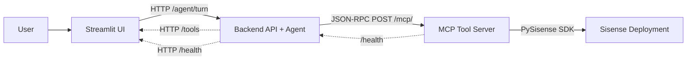
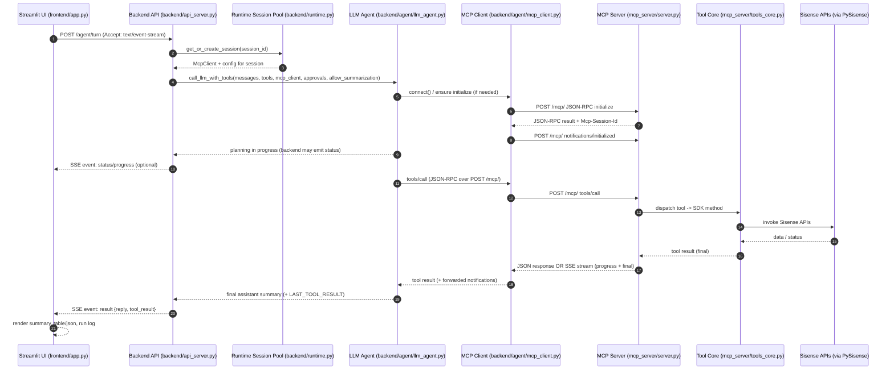
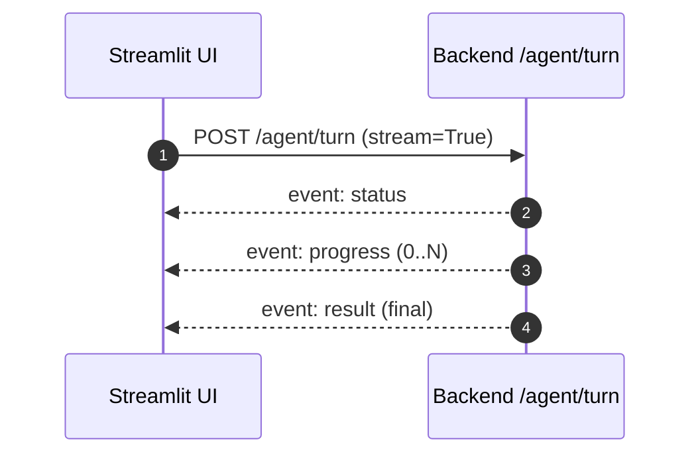
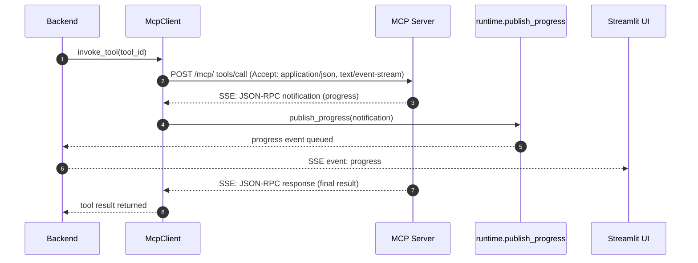
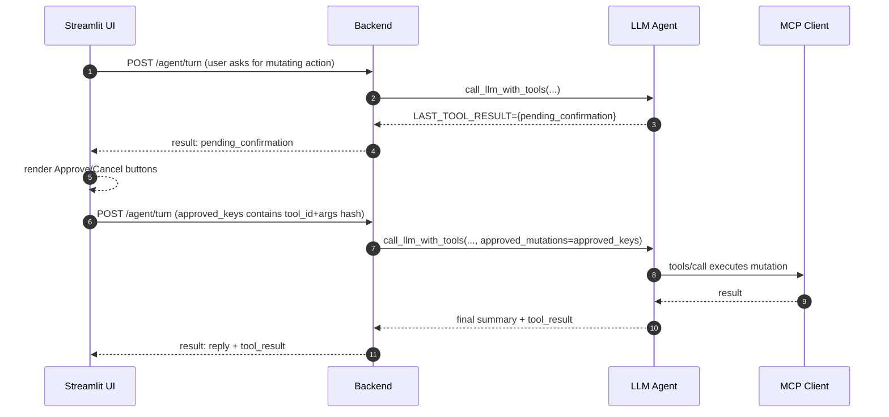
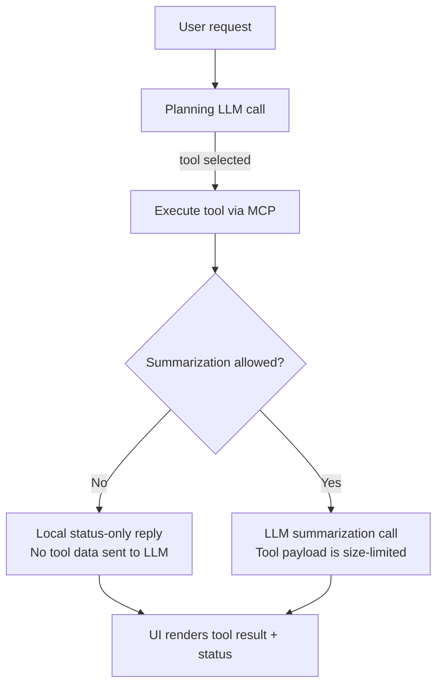
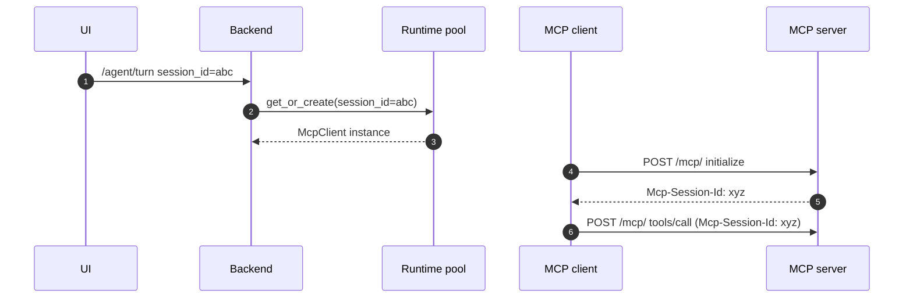
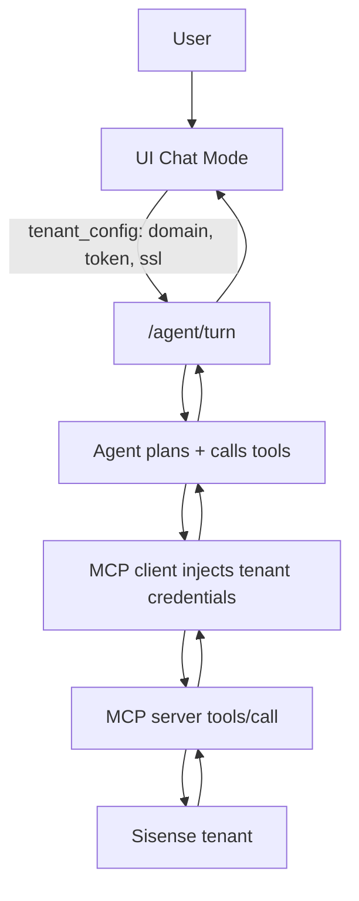
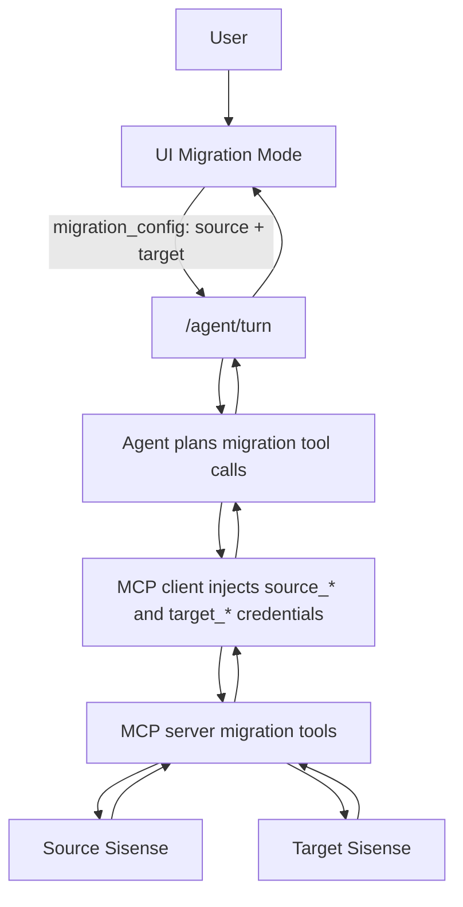

# FES Assistant v2: Execution Flow (Streamable HTTP + SSE)

This document explains the end-to-end execution flow of the FES Assistant, including:
- UI → Backend request lifecycle
- Backend → MCP Server (Streamable HTTP JSON-RPC)
- Streaming progress via **SSE** (Server-Sent Events)
- Mutation approval loop
- Optional “no summarization” privacy mode
- Session pooling and MCP session correlation

---

## 1. High-level architecture

---

## 2. Core “turn” lifecycle (UI → Backend → MCP → Backend → UI)

A single user request (“turn”) follows this lifecycle:

1. UI collects input + relevant session configs (tenant or migration).
2. UI calls backend **`POST /agent/turn`** with **Accept: `text/event-stream, application/json`**.
3. Backend:
   - Retrieves/creates a long-lived MCP client for the session.
   - Runs the agent orchestration (planning → tools → summarize).
4. Backend streams progress to UI (SSE) and ends with a final result.
5. UI renders:
   - live progress lines
   - final assistant summary
   - tool result table/JSON
   - run log (collapsed expander)

---

## 3. SSE progress streaming (where it comes from)

There are **two** possible streaming paths:

### 3.1 UI ⇐ Backend streaming (primary for the UI)

The UI always requests SSE from the backend:
- UI sends `Accept: text/event-stream, application/json`
- Backend chooses SSE when streaming is enabled for that response path
- UI consumes events incrementally and renders progress

### 3.2 Backend ⇐ MCP Server streaming (tool progress)

For streaming-capable tools, the MCP server may return **`text/event-stream`** on the same POST `/mcp/` request:
- Contains **JSON-RPC notifications** (progress)
- Ends with a **JSON-RPC response** matching the request id

Your MCP client parses these notifications and forwards them to the backend runtime, which then forwards them to the backend SSE response.

> Optional: Some MCP servers can also emit progress on a separate long-lived subscription stream (GET `/mcp/`).  
> Your client supports auto-subscribe, but your primary UX is via backend SSE to the UI.

---

## 4. Mutation approval flow (two-phase execution)

Mutating tools (create/update/delete/migrations) require user approval:

1. LLM selects a mutating tool
2. Agent does **not** execute it immediately
3. Backend returns a `pending_confirmation` payload
4. UI shows an approval panel with tool name + args
5. On approval, UI re-calls `/agent/turn` with `approved_keys`
6. Agent re-executes the request, now permitted to run the mutating tool

**Approval key stability**
- Approval is matched by: `(tool_id, normalized_args_json)`  
- UI stores a set of these keys and passes them back on approval.

---

## 5. Privacy mode: summarization disabled

When summarization is disabled, tool results are **not** sent to the LLM for follow-up summarization.

### Behavior:
- The planning call may still occur.
- Tools still run.
- The agent returns a **basic status message** locally (e.g., “ran tool X, got N rows”).
- The tool result is still returned to the UI for table/JSON rendering.

---

## 6. Session and MCP session correlation

### 6.1 UI session_id
- Streamlit creates a per-tab `session_id` and sends it on every `/agent/turn`.
- Backend uses this `session_id` to maintain a long-lived MCP client per UI tab.

### 6.2 MCP session id (`Mcp-Session-Id`)
- MCP server returns an `Mcp-Session-Id` header.
- MCP client stores it and includes it in subsequent requests.
- This enables correlated progress and consistent server-side session behavior.

---

## 7. Execution flows by UI mode

### 7.1 Chat mode (single tenant)

### 7.2 Migration mode (source + target)

---

## 8. Appendix: event shapes (backend → UI)

Typical SSE event types:
- `status`:
  - `{ "phase": "planning" | "executing_tools" | "summarizing" | ... }`
- `progress`:
  - `{ "message": "...", "detail": "...", ... }`
- `result`:
  - `{ "reply": "<assistant text>", "tool_result": {...} }`
- `error`:
  - `{ "error": "<message>" }`
- `keepalive`:
  - `{ "ts": "<timestamp>" }`

---

## 9. Source of truth: modules and responsibilities

### 9.1 Execution responsibility chain (end-to-end, with agentic labels)

1. **Frontend (`frontend/app.py`) — Client UI / Session Controller**  
   Owns Streamlit session state, connection forms (tenant/migration), approvals UI, and sends `POST /agent/turn` with conversation history + connection details. Requests streaming with `Accept: text/event-stream, application/json`.

2. **Backend API (`backend/api_server.py`) — API Gateway + SSE Transport**  
   HTTP entry point (`/health`, `/tools`, `/agent/turn`). For `/agent/turn`, it handles the **SSE transport** to the UI and delegates execution to the runtime.

3. **Agent Runtime (`backend/runtime.py`) — Orchestrator Runtime / Session Manager**  
   Owns the per-UI-session runtime: a concurrency-safe session pool that maps `session_id → McpClient + configs`. Wires a per-turn progress callback used by backend SSE streaming.

4. **LLM Layer (`backend/agent/llm_agent.py`) — Agent Orchestrator (Planner + Policy + Optional Summarizer)**  
   This is the “agent brain” for a turn:
   - **Planner:** selects tool(s) + arguments via LLM planning call  
   - **Policy/Guardrails:** enforces mutation confirmation (two-phase approval)  
   - **Executor loop coordinator:** invokes tools via the MCP client  
   - **Summarizer (optional):** performs a follow-up LLM summary call when allowed  
   - Produces `LAST_TOOL_RESULT` (including `pending_confirmation`)

5. **MCP Client (`backend/agent/mcp_client.py`) — Tool Transport Client (MCP Streamable HTTP)**  
   Executes tool calls over MCP Streamable HTTP:
   - Issues JSON-RPC over `POST /mcp/`
   - Consumes SSE when the MCP server streams tool progress
   - Maintains `Mcp-Session-Id` for MCP session correlation
   - Forwards MCP progress notifications into the runtime callback (so backend can stream them to UI)

6. **MCP Server Transport (`mcp_server/server.py`) — Tool Host Transport (Streamable HTTP + SSE)**  
   Implements MCP Streamable HTTP endpoints:
   - `GET /mcp` (optional subscription / keepalive for client probing)
   - `POST /mcp` for JSON-RPC (`initialize`, `tools/list`, `tools/call`)
   - Streams progress via SSE for streaming tool calls and returns a final JSON-RPC result frame

7. **Tool Router / Executor Adapter (`mcp_server/tools_core.py`) — Tool Router + Executor Adapter**  
   The server-side “tool execution brain”:
   - loads/normalizes the tool registry
   - resolves tool_id → SDK module/method
   - constructs PySisense clients (single tenant or migration source/target)
   - enforces argument validation/coercion + mutation audit rules
   - injects an `emit` callback for streaming tools and produces progress events

8. **PySisense SDK + Sisense APIs — Tool Implementation Layer**  
   The underlying SDK + Sisense REST APIs that perform the actual read/write/migration work.

### 9.2 Module-by-module responsibilities (implementation mapping)

- `frontend/app.py`
  - UI, session state, SSE parsing, progress rendering, approvals UX
- `backend/api_server.py`
  - HTTP API `/agent/turn`, SSE response streaming, tool list endpoint
- `backend/runtime.py`
  - session pool, long-lived MCP client per UI session, progress callback wiring
- `backend/agent/llm_agent.py`
  - planning, tool execution loop, mutation approvals, summarization (optional)
- `backend/agent/mcp_client.py`
  - MCP JSON-RPC client, SSE parsing for MCP responses, session headers, retries/timeouts
- `mcp_server/server.py`
  - MCP Streamable HTTP transport, SSE for streaming tool calls, request routing
- `mcp_server/tools_core.py`
  - tool registry loading, SDK client construction, tool dispatch, emit/progress integration

### 9.3 Runtime flow across components (by source file)

```mermaid
flowchart LR
  A[frontend/app.py<br/>Client UI - Session Controller] --> B[backend/api_server.py<br/>API Gateway - SSE Transport]
  B --> C[backend/runtime.py<br/>Orchestrator Runtime - Session Manager]
  C --> D[backend/agent/llm_agent.py<br/>Agent Orchestrator<br/>Planner - Policy - Summarizer optional]
  D --> E[backend/agent/mcp_client.py<br/>Tool Transport Client<br/>MCP Streamable HTTP - SSE]
  E --> F[mcp_server/server.py<br/>Tool Host Transport<br/>POST mcp - SSE streaming]
  F --> G[mcp_server/tools_core.py<br/>Tool Router - Executor Adapter<br/>Registry to SDK dispatch - emit]
  G --> H[PySisense SDK<br/>Tool Implementation Layer]
  H --> I[Sisense APIs<br/>Deployment or deployments]
```

