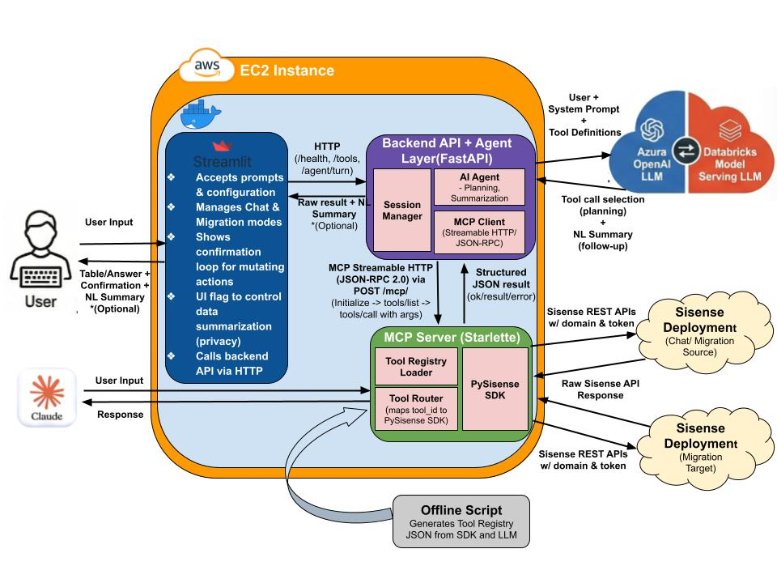

# 🤖 FES Assistant: Your Agentic Sisense Co-pilot

## ⚠️ Experimental Project Notice

### Community-Contributed Tool from Sisense Field Engineering

This project is an experimental tool developed by Sisense Field Engineering to facilitate customer learning and exploration of Sisense capabilities. While maintained by Field Engineering, it is shared "as-is" to encourage feedback and experimentation.

Important Disclaimer: This tool is not part of the core Sisense product release lifecycle and does not undergo the same validation, support, or certification processes as generally available (GA) Sisense features. It is intended to complement, not replace, officially supported Sisense features.

---

## Technical & Security Considerations

### Deployment & Execution Control
- Local SDK Usage (PySisense): All processing logic runs locally on your machine or server. No data is transmitted to Sisense Field Engineering.
- Self-hosted Components (FES Assistant / MCP Server): These components are designed for deployment within your own environment (on-prem or VPC). You maintain complete control over infrastructure, security configuration, access controls, and logs.

### Data & LLM Handling
- LLM Feature Status: The FES Assistant summarization feature is disabled by default.
- Data Transmission: When the summarization feature is enabled, responses retrieved via the Sisense SDK may be sent to your chosen Large Language Model (LLM) provider for processing.
- Third-Party Clients: When using the MCP Server with third-party clients (e.g., IDE agents or desktop assistants like Claude Desktop), data retrieved from Sisense is passed directly to the client’s LLM.
- Customer Responsibility: Customers are responsible for selecting an LLM provider that meets their organization’s data privacy and security requirements.

---

## Recommended Usage Guidelines
- Environment: Use the tool primarily in sandbox or non-production environments.
- Access: Utilize a dedicated Sisense service account with limited privileges.
- Validation: Thoroughly review and validate the tool's behavior before any broader adoption within your organization.

---

## About FES Assistant

FES Assistant is an MCP-powered, agentic toolkit for Sisense environment operations. It helps you automate governance checks, migrations, and day-to-day admin workflows using natural language, so you can orchestrate tasks without writing one-off API scripts.

---

## 🚀 Why every Sisense user needs a Co-pilot:

* **📈 For Dashboard Designers:** Instantly find dashboards, audit your own widgets, and get environment well-checks without digging through menus.
* **🏗️ For Data Designers:** A specialized co-pilot for model optimization—find unused fields, audit M2M relationships, and build data models via natural language chat.
* **🛡️ For Admins:** An automation engine for environment/tenant migrations, bulk governance, and platform-wide orchestration-as-code.

---



*For the full end-to-end execution flow (including SSE streaming, progress propagation, and the mutation approval loop), see [`Execution_Flow.md`](./Execution_Flow.md).*

---

## Key Agentic Capabilities

* **Autonomous Infrastructure Audits:** Ask the agent to find Many-to-Many relationships, unused datamodel fields, or orphaned assets across your entire environment.
* **Zero-Touch Migrations:** Execute complex cross-tenant moves for dashboards and datamodels with built-in safety loops and confirmation steps.
* **Protocol-First Integration:** Operates as a **Streamable HTTP MCP Server**, allowing you to use this UI or plug Sisense "tools" directly into external agents like Claude Desktop.
* **Real-Time Progress Visibility:** Built with **Server-Sent Events (SSE)** to provide live streaming updates (V2) for long-running migrations and bulk tasks.
* **Privacy-First Logic:** Includes a manual **Summarization Toggle** to ensure raw data responses stay within your infrastructure when required.

---

## 🏗️ Architecture & Flow

The FES Assistant is built as a modular stack to ensure you can use the MCP server independently if desired:

- **The Orchestrator:** A **Streamlit UI** (`frontend/app.py`) for mission control.
- **The Brain:** A **Backend API + Agent Layer** (`backend/api_server.py`) that handles planning, tool selection, and confirmation loops.
- **The Bridge:** An **MCP Streamable HTTP Server** (`mcp_server/server.py`) that translates AI intent into [PySisense](https://github.com/sisense/pysisense) SDK actions.

MCP Server docs: [Meta-Management MCP Server](mcp_server/README.md)

---

## Quick links

- [`docker-compose.yml`](./docker-compose.yml)
- [`docker-compose.prod.yml`](./docker-compose.prod.yml)
- [`Dockerfile.mcp`](./Dockerfile.mcp)
- [`Dockerfile.backend`](./Dockerfile.backend)
- [`Dockerfile.ui`](./Dockerfile.ui)
- [`.env.example`](./.env.example)
- [`config_prod.sh`](./config_prod.sh)

- [`frontend/app.py`](./frontend/app.py)
- [`backend/api_server.py`](./backend/api_server.py)
- [`backend/runtime.py`](./backend/runtime.py)
- [`backend/agent/llm_agent.py`](./backend/agent/llm_agent.py)
- [`backend/agent/mcp_client.py`](./backend/agent/mcp_client.py)

- [`mcp_server/server.py`](./mcp_server/server.py)
- [`mcp_server/tools_core.py`](./mcp_server/tools_core.py)

- [`Execution_Flow.md`](./Execution_Flow.md)
- [`refresh_registry.sh`](./refresh_registry.sh)

---

## Features

- **Two main modes in the UI**
  - **Chat with deployment**
    - Connect to a single Sisense deployment and talk to an agent that can inspect and operate on that environment.
  - **Migrate between deployments**
    - Connect **source** and **target** Sisense environments and use migration tools to move assets.

- **SSE progress streaming (V2)**
  - The UI streams agent turns and shows live progress updates.
  - Progress is captured into a per-run “run log” and rendered under assistant responses.
  - Works especially well for long migrations and bulk operations.

- **MCP-powered tools over PySisense**
  - PySisense SDK methods are wrapped as MCP tools and registered via a **tool registry JSON**.
  - Tools cover areas like access management, datamodels, dashboards, migration, and well-checks.

- **Two LLM backends (configurable)**
  - Switch between **Azure OpenAI** and **Databricks Model Serving** by changing environment variables.
  - The agent layer abstracts over the provider so the rest of the app behaves the same.

- **Safety via confirmation loops**
  - For **create / modify / delete / migration**-style operations, the agent uses a **confirmation loop**:
    - The agent explains what it plans to do (which assets, which environments, what changes).
    - The UI shows this plan to the user.
    - The action is only executed after explicit confirmation.

- **Optional “no summarization” privacy mode**
  - You can disable sending tool results back to the LLM via an environment variable and (optionally) a UI toggle.
  - In that mode, tools still run, but the assistant only returns lightweight status messages.

---

## Architecture

High-level flow:

1. User interacts with **Streamlit** in `frontend/app.py`.
2. The UI calls the **backend API** (`backend/api_server.py`) over HTTP (for example `/health`, `/tools`, `/agent/turn`).
3. The backend:
   - Manages **per-session MCP clients** and state in `backend/runtime.py`.
   - Uses `backend/agent/llm_agent.py` for planning, tool selection, mutation approvals, and summarization.
   - Uses `backend/agent/mcp_client.py` to call the MCP server (JSON-RPC over Streamable HTTP).
   - Streams progress to the UI over SSE when the UI requests it.
4. The **MCP Streamable HTTP server** (`mcp_server/server.py`):
   - Exposes `/health`.
   - Exposes an MCP endpoint `/mcp/` implementing MCP **Streamable HTTP** (JSON-RPC).
   - For streaming-capable tool calls, responds with **SSE** containing:
     - JSON-RPC notifications (progress), then
     - a final JSON-RPC response message with the matching request id.
   - Uses `mcp_server/tools_core.py` to map tool IDs to PySisense SDK calls.
   - Reads the tool registry JSON from `config/`.
5. PySisense uses Sisense REST APIs to talk to your Sisense deployments.

### Folder structure

```text
Root/
  backend/
    agent/
      __init__.py
      llm_agent.py        # LLM orchestration: planning, tool selection, approvals, optional summarization
      mcp_client.py       # MCP Streamable HTTP client (JSON-RPC over POST /mcp/, supports SSE tool progress)
    __init__.py
    runtime.py            # Session pool, long-lived McpClient per UI session, progress bridging
    api_server.py         # FastAPI backend (JSON + SSE on /agent/turn; exposes /health and /tools)

  config/
    tools.registry.json                 # Base tool registry generated from the SDK
    tools.registry.with_examples.json   # Registry enriched with LLM examples

  frontend/
    app.py               # Streamlit UI (SSE client for backend /agent/turn)

  images/
    FES_ASSISTANT_AD.png
    ui1.png
    ui2.png

  logs/                  # Runtime logs (rotated; not committed)

  mcp_server/
    server.py            # MCP Streamable HTTP server (/mcp/ JSON-RPC, /health; SSE for streaming tools/call)
    tools_core.py        # Registry loading, SDK client construction, tool dispatch, emit/progress integration

  scripts/
    __init__.py
    01_build_registry_from_sdk.py       # Introspects PySisense SDK and builds tools.registry.json
    02_add_llm_examples_to_registry.py  # Uses an LLM to add examples; writes tools.registry.with_examples.json
    README.md                           # Notes for the scripts

  .env.example
  .gitignore
  .dockerignore
  LICENSE
  README.md
  Execution_Flow.md
  refresh_registry.sh
  requirements.txt

  # Docker-related files
  Dockerfile.backend        # Image for backend FastAPI service
  Dockerfile.ui             # Image for Streamlit UI
  Dockerfile.mcp            # Image for MCP Streamable HTTP server
  docker-compose.yml        # Local/dev docker-compose (uses .env)
  docker-compose.prod.yml   # Example production compose (uses real env vars)
  config_prod.sh            # Example script to export prod env vars (no secrets)
```

---

## Prerequisites

- Python 3.10+
- A Sisense Fusion deployment (or multiple, for migration use cases)
- Access to at least one LLM provider:
  - Azure OpenAI, or
  - Databricks Model Serving
- (Optional but recommended) Docker + Docker Compose for containerized runs

---

## Environment configuration

This project keeps **LLM credentials and service configuration** in environment variables.  
Sisense base URLs and tokens are entered directly into the Streamlit UI and stored only in session state for the current browser session.

For local development you can use a `.env` file (see [`.env.example`](./.env.example)).  
In Docker / production, you should set the same values as real environment variables on each container (for example via `--env-file`, `docker-compose` `env_file:`, or sourcing `config_prod.sh`).

### 1) UI (Streamlit) configuration

Read by `frontend/app.py`:

- `FES_LOG_LEVEL`  
  Log level for the UI process: `DEBUG`, `INFO`, `WARNING`, `ERROR`.

- `FES_BACKEND_URL`  
  URL of the backend FastAPI server that the UI calls for each turn.  
  Example: `http://localhost:8001`

- `FES_UI_IDLE_TIMEOUT_HOURS`  
  Idle timeout in hours for a Streamlit session. When exceeded, the UI clears `st.session_state`.

- `FES_ALLOW_SUMMARIZATION_TOGGLE`  
  Controls whether the “Allow summarization” checkbox is enabled in the UI.  
  - `true`  → user can toggle per session  
  - `false` → checkbox is disabled and always off

### 2) Backend (FastAPI) configuration

Read by `backend/api_server.py` and `backend/agent/llm_agent.py`:

- `FES_LOG_LEVEL`  
  Same as UI; controls backend logging.

- `ALLOW_SUMMARIZATION`  
  Backend hard kill switch for sending tool results (Sisense data) to the LLM.  
  - `true`  → allowed (subject to UI toggle)  
  - `false` → never sent to the LLM

- `LLM_PROVIDER`  
  Which LLM backend to use: `azure` or `databricks`.

Azure OpenAI (when `LLM_PROVIDER=azure`):

- `AZURE_OPENAI_ENDPOINT`
- `AZURE_OPENAI_DEPLOYMENT`
- `AZURE_OPENAI_API_KEY`
- `AZURE_OPENAI_API_STYLE` (usually `v1`)

Databricks (when `LLM_PROVIDER=databricks`):

- `DATABRICKS_HOST`
- `DATABRICKS_TOKEN`
- `LLM_ENDPOINT`

Optional LLM retry tuning:

- `LLM_HTTP_MAX_RETRIES`
- `LLM_HTTP_RETRY_BASE_DELAY`

### 3) Backend → MCP client configuration (SSE-aware)

Read by `backend/agent/mcp_client.py`:

- `PYSISENSE_MCP_HTTP_URL`  
  Base URL for the MCP Streamable HTTP server. The client calls `/mcp/` under this base URL.

- `PYSISENSE_MCP_HTTP_TIMEOUT`  
  Default timeout (seconds) for MCP calls.  
  Note: streaming tool calls remove the read timeout (unbounded) so long-running migrations can stream progress.

- `MCP_HTTP_MAX_RETRIES` and `MCP_HTTP_RETRY_BASE_DELAY`  
  Retry tuning for MCP calls. Recommended to keep retries low for long-running / non-idempotent tools.

Optional SSE behavior:

- `MCP_AUTO_SUBSCRIBE`  
  If `true`, the MCP client starts an optional long-lived `GET /mcp/` SSE subscription on connect.  
  This is useful for servers that emit progress on the GET stream instead of (or in addition to) the POST response.

- `MCP_STREAMING_TOOL_IDS`  
  Comma-separated list of tool ids treated as “streaming-sensitive” (long-running).  
  For these tools, the client removes read timeouts and expects SSE responses.

### 4) MCP tool server / PySisense configuration

Read by `mcp_server/tools_core.py` and `mcp_server/server.py`:

- `PYSISENSE_REGISTRY_PATH`  
  Path to the tools registry JSON.  
  Default: `config/tools.registry.with_examples.json`

- `ALLOW_MODULES`  
  Optional comma-separated list of modules to expose.  
  Example: `ALLOW_MODULES=access,datamodel`

- `PYSISENSE_SDK_DEBUG`  
  Optional flag passed down to `SisenseClient.from_connection(debug=...)`.  
  Set to `true` or `false`. Recommended: unset (or `false`) for normal use.

#### MCP tool naming (Claude compatibility)

- `MCP_TOOL_NAME_MODE`  
  Claude Desktop rejects tool names that contain `.` during tools/list discovery.  
  - `claude` → publish underscore tool names (recommended)  
  - `canonical` → publish dotted tool ids (legacy)

The server will still accept both underscore and dotted names on tool calls.

#### Concurrency caps (single-worker friendly)

These reduce head-of-line blocking with long-running migrations while keeping the MCP server at a single worker:

- `PYSISENSE_MAX_CONCURRENT_MIGRATIONS` (default: `1`)  
  Max number of migrations allowed to run concurrently.

- `PYSISENSE_MAX_CONCURRENT_READ_TOOLS` (default: `5`)  
  Max number of short/read tools allowed to run concurrently while migrations run.

### 5) Sisense configuration (entered in the UI, not in `.env`)

In **Chat with deployment** mode:
- Sisense domain (base URL)
- API token
- Verify SSL flag

In **Migrate between deployments** mode:
- Source domain + source API token (+ source SSL flag)
- Target domain + target API token (+ target SSL flag)

These credentials are supplied via the Streamlit forms, used to build `SisenseClient` instances inside the MCP tool server, and are not persisted.

---

## Tool registry generation

The MCP server uses a **tool registry JSON** that describes available tools, parameters, descriptions, and examples.

There are two stages:

1. `config/tools.registry.json` – built directly from the PySisense SDK.
2. `config/tools.registry.with_examples.json` – the same registry but enriched with examples.

Scripts in [`scripts/`](./scripts/) are responsible for this:

1. [`01_build_registry_from_sdk.py`](./scripts/01_build_registry_from_sdk.py)  
   Introspects the PySisense SDK classes, parses docstrings, infers JSON Schemas for parameters, tags tools, and writes `config/tools.registry.json`.

2. [`02_add_llm_examples_to_registry.py`](./scripts/02_add_llm_examples_to_registry.py)  
   Reads `config/tools.registry.json`, uses an LLM to generate examples per tool, and writes `config/tools.registry.with_examples.json`.

[`refresh_registry.sh`](./refresh_registry.sh) is a convenience wrapper to rebuild both registries.

At runtime, only the JSON files in `config/` are needed.

---

## Running locally (without Docker)

This is a simple three-process dev setup.

1) Create and activate a virtual environment

```bash
python -m venv .venv
source .venv/bin/activate     # Windows: .venv\Scripts\activate
```

2) Install dependencies

```bash
pip install --upgrade pip
pip install -r requirements.txt
```

3) Create a `.env` (see [`.env.example`](./.env.example))

4) Start the MCP Streamable HTTP server

In terminal 1:

```bash
uvicorn mcp_server.server:app --host 0.0.0.0 --port 8002 --workers 1
```

Why `--workers 1`:
- MCP Streamable HTTP sessions are stateful, and running multiple workers can break session continuity unless you add sticky routing.
- This project relies on a single worker and uses concurrency caps + streaming progress to stay responsive during long migrations.

5) Start the backend API

In terminal 2:

```bash
uvicorn backend.api_server:app --host 0.0.0.0 --port 8001
```

6) Start the Streamlit UI

In terminal 3:

```bash
streamlit run frontend/app.py
```

7) Open the UI

Streamlit will print a local URL (typically `http://localhost:8501`).

---

## Claude Desktop Integration (MCP Remote)

You can connect Claude Desktop directly to the PySisense MCP HTTP server using `mcp-remote`.

### 1) Start the MCP server

Make sure the MCP server is running:

```bash
uvicorn mcp_server.server:app --host 0.0.0.0 --port 8002 --workers 1
```

### 2) Configure Claude Desktop

Steps:
1. Open Claude Desktop.
2. Go to Settings.
3. Under **Developer**, select **Edit Config**. This opens `claude_desktop_config.json`.
4. Add the following configuration:

```json
{
  "mcpServers": {
    "my-local-server": {
      "command": "npx",
      "args": ["-y", "mcp-remote", "http://localhost:8002/mcp/"]
    }
  }
}
```

Restart Claude Desktop after saving the file.

### 3) Avoid exposing Sisense credentials in Claude

To avoid putting your Sisense domain/token inside Claude, set them as environment variables on the machine where the MCP server is running (for example in that machine’s `.env`).

The MCP server’s tools_core.py includes optional default-tenant fallback logic that fills in the Sisense domain and token from environment variables when the client omits them, before invoking the underlying SDK method.

Add these env vars on the MCP server host:

```bash
PYSISENSE_USE_DEFAULT_TENANT=true
PYSISENSE_DEFAULT_DOMAIN="https://your-sisense-domain"
PYSISENSE_DEFAULT_TOKEN="your-api-token"
PYSISENSE_DEFAULT_SSL=false
```

Important: You do not need to tell Claude to pass empty domain/token fields. If default-tenant fallback is enabled on the MCP server, the server can fill them in from its environment.

Note on SSE in Claude Desktop:
- The MCP server supports SSE progress streaming.
- Some MCP clients may not yet render progress events in the main UI (they may only appear in logs). This does not affect the Streamlit UI path, which fully supports SSE progress end-to-end.

---

## Running with Docker (local/dev)

The repo includes three Dockerfiles and a `docker-compose.yml` for local development:

- [`Dockerfile.ui`](./Dockerfile.ui) – Streamlit UI
- [`Dockerfile.backend`](./Dockerfile.backend) – FastAPI backend
- [`Dockerfile.mcp`](./Dockerfile.mcp) – MCP tool server
- [`docker-compose.yml`](./docker-compose.yml) – runs all three together

### 1) Create a `.env` for local Docker

Create a `.env` in the project root with your LLM and service configuration (same keys as in the Environment configuration section).  
This file is not committed to git and is not baked into images.

### 2) Build and start the stack

From the project root:

```bash
docker compose up --build --force-recreate
```

Then open:

- UI: `http://localhost:8501`
- Backend docs: `http://localhost:8001/docs`
- MCP health: `http://localhost:8002/health`

### Useful Docker commands

Stop the stack:

```bash
docker compose down
```

Hard reset (remove containers, images, volumes, and build cache):

```bash
docker compose down --rmi all --volumes --remove-orphans
docker builder prune -a -f
```

---

## Production-style deployment (example)

For production you typically:

- Push built images to a registry (Docker Hub, ECR, etc.)
- Use a separate compose file (for example [`docker-compose.prod.yml`](./docker-compose.prod.yml))
- Set environment variables on the host or via your orchestrator

An example non-secret env script is included: [`config_prod.sh`](./config_prod.sh).

Secrets like `AZURE_OPENAI_API_KEY` or `DATABRICKS_TOKEN` should be provided via a secure channel (SSM Parameter Store, Secrets Manager, etc.).

SSE notes for production reverse proxies:
- Ensure your proxy/load balancers support SSE and do not buffer responses.
- Common requirements include disabling proxy buffering and increasing idle timeouts for long-lived responses.

---

## Using the app

### 1) Chat with deployment

- Select **Chat with deployment**.
- Enter Sisense domain, API token, and SSL preference.
- Click **Connect**.

Example questions:

- “List all dashboards.”
- “Show all users in the ‘Analysts’ group.”
- “Find all fields that are not used in datamodel XYZ.”

For write operations (create/update/delete), you will see a confirmation step before execution.

### 2) Migrate between deployments

- Switch to **Migrate between deployments**.
- Fill in Source and Target Sisense environments (domain + token + SSL).
- Connect both.

Example requests:

- “Migrate this dashboard from source to target.”
- “Migrate all datamodels, overwriting existing ones.”
- “Migrate these three dashboards and duplicate them on target.”

Screenshots:


---

## Logging

- Log files are written under `logs/` (git-ignored).
- Sensitive values such as tokens are scrubbed before being written to logs where possible.
- For production, set log levels to `INFO` or `WARNING` instead of `DEBUG`.

---

## 🔒 Security & Deployment Best Practices

While this is an experimental tool, we recommend the following "Security First" approach for your deployment:

* **Authentication:** Deploy the UI and Backend behind your organization’s SSO, a VPN, or a Secure Reverse Proxy (e.g., Nginx with Auth).
* **Credential Management:** Use a dedicated, limited-privilege Sisense Service Account and ensure your LLM API keys are stored securely (e.g., via environment secrets, not hard-coded).
* **Network Isolation:** Implement network-level restrictions (firewalls/VPC rules) so only trusted internal hosts can reach the Backend and MCP server endpoints.
* **Service Scoping:** If using Claude Desktop via mcp-remote, ensure you utilize a secure tunneling method (e.g., SSH Tunnel, Tailscale) if the server is not on your local machine.

---

## ⚖️ Community Disclaimer & Liability Shield

**Important: Field-Developed Ecosystem Extension**

These tools are community-contributed projects developed by Sisense Field Engineering. They are **not** official Sisense product features and do not fall under standard Sisense SLAs, Support, or Security Certifications.

* **Local Library Execution (PySisense SDK):** As a Python package installed via PyPI, all logic executes locally on your workstation or server. No data is ever transmitted to Sisense Field Engineering.
* **Self-Hosted Applications (MCP Server & FES Assistant):** These are designed to be deployed within your own private network or VPC. You maintain full ownership of the hosting environment, logs, and security configurations.
* **LLM Data Exposure & Summarization:**
    * **FES Assistant:** Features a manual **Summarization Toggle**. By default, the LLM only sees your prompt and tool definitions to determine intent. Optionally, when enabled, the raw response from the SDK (which may contain metadata or specific tool-level data) is sent to the LLM to generate a natural language summary.
    * **MCP Server:** When used with third-party clients (e.g., Claude Desktop, IDE Agents), all data retrieved via the SDK is passed directly to the host client's LLM to generate a response.
* **Responsibility:** By using these tools, the customer/user acknowledges that Sisense metadata and API responses will be processed by their chosen LLM provider. Customers are **solely responsible** for ensuring their LLM provider (OpenAI, Anthropic, Databricks Foundation Models API, etc.) meets their organization’s data privacy and security standards.
* **Liability & Risk:** These tools are provided **"as-is"** for experimental purposes. Sisense and its employees are not liable for security vulnerabilities, third-party LLM data exposure, or environment disruptions.
* **Non-Production Recommendation:** We strongly recommend testing these tools in a sandbox environment and using them with a dedicated, limited-privilege Sisense Service Account.

---
## DEMO

https://github.com/user-attachments/assets/1ef44ff2-21c4-4be9-8a3f-8761f0641d6e

---

## Related project

- [PySisense](https://github.com/sisense/pysisense) – the unofficial Python SDK for Sisense Fusion APIs. This project uses PySisense for Sisense-side actions and leverages its docs/examples to build the MCP tool registry.

---

## License

This project is licensed under the MIT License. See the [`LICENSE`](./LICENSE) file for details.
