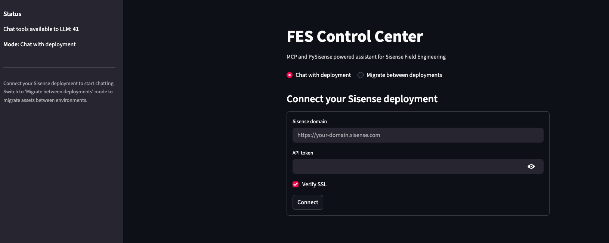
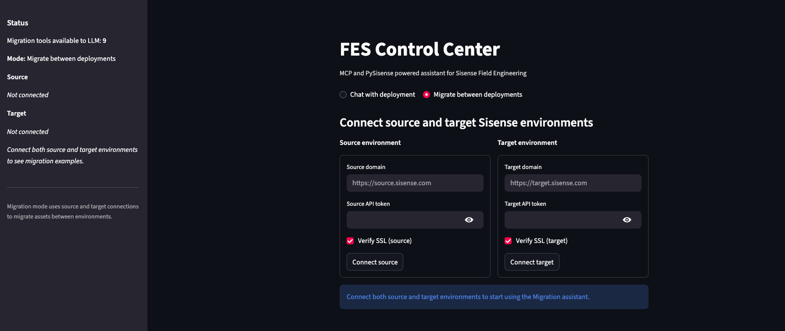

# FES Assistant (mcp-pysisense)

Agentic Streamlit application and MCP (Model Context Protocol) tool server built on top of the [PySisense](https://github.com/sisense/pysisense) SDK.

FES Assistant lets Sisense Field Engineering (and power users) do two things:

1. **Chat with a single Sisense deployment** – ask questions, inspect assets, and perform safe actions via PySisense tools.
2. **Migrate between deployments** – connect a source and target Sisense environment and use migration-focused tools to move assets.

Under the hood:

* The UI is built with **Streamlit**.
* The backend tools are exposed via an **MCP server** running as a **subprocess started from `app.py`**.
* Sisense automation is handled by **PySisense (SDK)**.
* The agent can use **two LLM providers**:

  * **Azure OpenAI**
  * **Databricks LLM / Model Serving**

---

## Features

* **Two main modes** (as seen in the UI):

  * **Chat with deployment**

    * Connect to a single Sisense deployment and talk to an agent that can inspect and operate on that environment.
  * **Migrate between deployments**

    * Connect **source** and **target** Sisense environments and use migration tools to move assets.

* **MCP-powered tools over PySisense**

  * PySisense SDK methods are wrapped as MCP tools and registered via a **tool registry JSON**.
  * Tools cover areas like access management, datamodels, dashboards, and migrations.

* **Two LLM backends (configurable)**

  * Switch between **Azure OpenAI** and **Databricks** by changing environment variables.
  * The agent layer abstracts over the provider so the rest of the app behaves the same.

* **Streamlit front-end**

  * **FES Assistant** dashboard.
  * Status panel showing available tools and current mode.
  * Forms to connect Sisense environments:

    * In **Chat** mode: a single Sisense domain + API token.
    * In **Migration** mode: separate **source** and **target** domain + token pairs.

* **Safety via confirmation loops**

  * For **create / modify / delete / migration**-style operations, the agent uses a **confirmation loop**:

    * The agent explains what it plans to do (which assets, which environments, what changes).
    * The UI shows this plan to the user.
    * The action is only executed after explicit confirmation.
  * This helps keep powerful operations safe and inspectable.

---

## Architecture

High-level flow:

1. User interacts with **Streamlit (`app.py`)**.
2. `app.py` starts the **MCP server** as a **subprocess** and communicates with it locally.
3. The MCP server exposes **PySisense-backed tools** described in a tool registry JSON.
4. The agent (running inside the app) calls MCP tools when the LLM decides actions are needed.
5. Sisense responses are returned to the agent, summarized, and rendered in the UI.

### Folder structure

The core layout looks like this:

```text
pysisense-mcp-chatbot/
  chatbot/                 # Agent logic, prompt templates, provider selection, etc.
  config/                  # Tool Registry(JSON)
  logs/                    # Log files (runtime logs, structured logging output)
  mcp_server/              # MCP server implementation and tool wiring for PySisense
  scripts/                 # Helper scripts (e.g. tool registry builder)

  .gitignore               # Git ignore rules
  app.py                   # Streamlit entry point; starts MCP server as subprocess
  README.md                # This file
  refresh_registry.sh      # Convenience script to rebuild tool registry from pysisense docs/examples
  requirements.txt         # Python dependencies (includes pysisense from PyPI)
```

---

## Prerequisites

* Python 3.10+
* A Sisense Fusion deployment (or multiple for migration use cases)
* Access to at least one LLM provider:

  * Azure OpenAI **or** Databricks LLM / Model Serving

---

## Environment configuration

This project keeps LLM credentials in environment variables and **does not store Sisense credentials in `.env`**. Sisense base URLs and tokens are always entered directly into the Streamlit UI and stored in session state only.

### .env (LLM configuration)

The `.env` file (not committed to git) is used for:

Common:

* `LLM_PROVIDER` – which backend to use, e.g. `azure` or `databricks`.

When using **Azure OpenAI** (`LLM_PROVIDER=azure`):

* `AZURE_OPENAI_ENDPOINT`
* `AZURE_OPENAI_DEPLOYMENT`
* `AZURE_OPENAI_API_KEY`
* `AZURE_OPENAI_API_STYLE`


When using **Databricks** (`LLM_PROVIDER=databricks`):

* `DATABRICKS_HOST`             # e.g. https://<workspace-url>
* `DATABRICKS_TOKEN`            # personal access token
* `LLM_ENDPOINT`                # model serving endpoint for the LLM

Sisense configuration is provided **only through the Streamlit UI**:

* In **Chat with deployment** mode:

  * `Sisense domain` (base URL)
  * `API token`

* In **Migrate between deployments** mode:

  * `Source domain` + `Source API token`
  * `Target domain` + `Target API token`

These are captured from the forms in the UI and held in memory (session state) for the current session.

---

## Tool registry generation

The MCP server uses a **tool registry JSON** that describes available tools, parameters, and descriptions for the LLM.

This registry is generated from:

* PySisense docs and examples in a local clone of the
  [PySisense](https://github.com/sisense/pysisense) repo:

  * `examples/` (e.g. `access_management_example.md`, `datamodel_example.md`)
  * `docs/` (e.g. `access_management.md`, `datamodel.md`)
* An internal script (e.g. `scripts/build_registry.py`) that:

  * Reads these markdown files.
  * Uses an LLM to synthesize tool descriptions and parameter schemas.
  * Writes a consolidated `tool_registry.json` into this project.

A helper script like `refresh_registry.sh` can:

1. Assume a sibling folder layout such as:

   ```text
   /workspace
     /pysisense          # full PySisense repo
     /pysisense_chatbot  # this project
   ```

2. Set `PYSISENSE_EXAMPLES_ROOT` and `PYSISENSE_DOCS_ROOT` env vars (or use default `../pysisense/examples` and `../pysisense/docs`).

3. Run the registry builder to regenerate the JSON.

At runtime, the MCP server only needs the resulting JSON file; the full PySisense repo is not required on the server.

---

## Running locally

1. **Clone the repo**

   ```bash
   git clone https://github.com/hnegi01/pysisense-mcp-chatbot.git
   cd pysisense-mcp-chatbot
   ```

2. **Create and activate a virtual environment**

   ```bash
   python -m venv .venv
   source .venv/bin/activate  # On Windows: .venv\Scripts\activate
   ```

3. **Install dependencies**

   ```bash
   pip install --upgrade pip
   pip install -r requirements.txt
   ```

4. **Create a `.env` file with LLM configuration**

   Configure the variables described in the **Environment configuration** section above.

5. **Run the Streamlit app**

   ```bash
   streamlit run app.py
   ```

   This will:

   * Start the Streamlit UI.
   * Start the MCP server as a **subprocess** from within `app.py`.
   * Wire the agent and tools so that the LLM can call MCP tools when needed.

6. **Open the UI**

   Streamlit will print a local URL (typically `http://localhost:8501`). Open this in your browser to use the app.

---

## Using the app

### 1. Chat with deployment mode

This is the default mode when the app loads.

* **Status panel** (left):

  * Shows how many chat tools are available to the LLM.
  * Indicates that the mode is **Chat with deployment**.

* **Connection form** (right):

  * `Sisense domain` – your Sisense base URL.
  * `API token` – Sisense API token.
  * `Verify SSL` checkbox.

**Flow:**

1. Enter the domain and API token for your Sisense deployment.
2. Click **Connect**.
3. Once connected, the agent can:

   * Inspect assets (dashboards, datamodels, users, etc.).
   * Answer questions about the deployment.
   * Propose operations using the available tools.

**Confirmation loop for changes:**

* For actions like **creating, updating, or deleting** Sisense objects, the agent will:

  * Describe the proposed change (what will be created/modified/deleted).
  * Show this plan in the chat.
  * Ask you to confirm before executing any write operation.

This keeps powerful actions transparent and gives you a chance to adjust the request before anything changes on the Sisense side.

### 2. Migrate between deployments mode

Switch to **Migrate between deployments** using the radio buttons at the top of the UI.

The layout updates to show **two connection panels**:

* **Source environment**

  * `Source domain`
  * `Source API token`
  * `Verify SSL (source)`

* **Target environment**

  * `Target domain`
  * `Target API token`
  * `Verify SSL (target)`

The status panel on the left will now show:

* Number of **migration tools** available to the LLM.
* Connection status for **Source** and **Target**.

**Flow:**

1. Enter connection details for both **Source** and **Target** environments.
2. Click **Connect source** and **Connect target**.
3. Once both are connected, you can:

   * Request migration of assets (e.g., dashboards, data models, access settings).

**Migration confirmation loop:**

* For any migration or cross-environment change, the agent:

  * Proposes a detailed migration plan (which assets, in which direction, and what will be created/updated on the target).
  * Only performs the migration after you explicitly confirm.

This reduces the risk of accidental changes and makes each migration step auditable from the chat history.





---

## LLM providers

The agent can use either **Azure OpenAI** or **Databricks** as the underlying LLM.

* The provider is chosen via `LLM_PROVIDER` in `.env`.
* Provider-specific credentials are also read from `.env`.
* The agent logic and MCP tooling remain the same regardless of the provider; only the LLM backend changes.

This design allows you to:

* Start locally with one provider.
* Switch to another provider without changing the tool registry or UI.

---

## Logging

The project favours **structured logging and log files** over print statements.

* Runtime logs are typically written under `logs/`.
* Logging covers:

  * MCP tool calls and responses.
  * LLM requests and high-level responses (without leaking sensitive data).
  * Sisense API interactions via PySisense.

These logs are useful for debugging, auditing migrations, and understanding agent behavior.

---

## Related project

* [PySisense](https://github.com/sisense/pysisense) – the unofficial Python SDK for Sisense Fusion APIs. This project uses PySisense for all Sisense-side actions and leverages its docs and examples to build the MCP tool registry.

---

## License

This project is licensed under the MIT License. See the `LICENSE` file for details.
